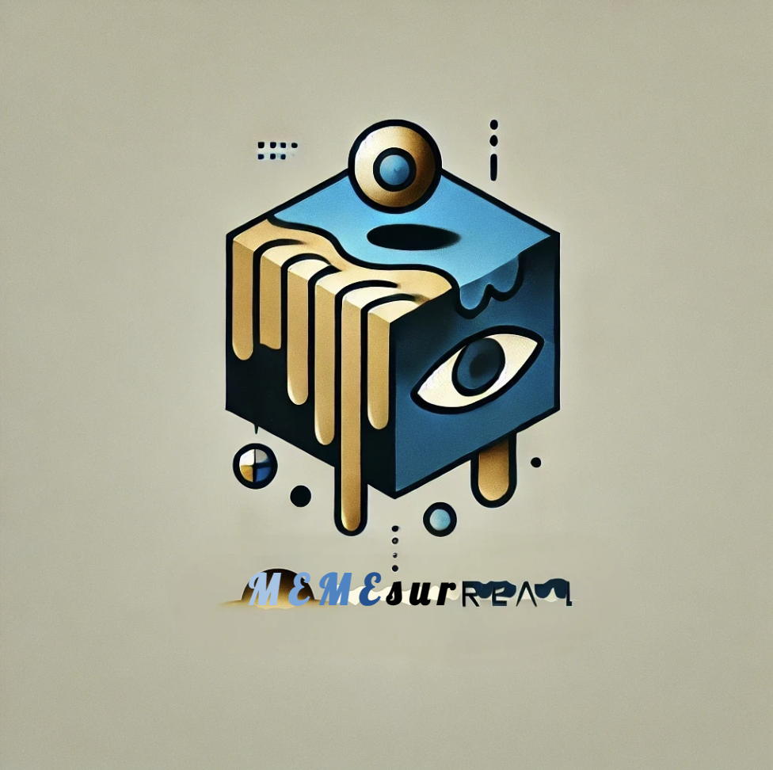

# MEMESurreal

## Introduction 

**_MEMESurreal_, built with UniswapV4 hooks and CDP AgentKit, is an Agent-powered Meme Launchpad where users can enjoy customized LP profitability while autonomous agents can launch UniV4 pool.** 

Pitch Deck:
https://docs.google.com/presentation/d/1ySrB0Ufig1rUKbu5o64p1uFz4ZHNv4AuqJtPWdd82sc/edit?usp=sharing

## Key Features

1. **UniV4 pools**: UniV4 hooks enable customized fee distribution to liquidity providers through its swap lifecycle, revolutionizing LP profitability while maintaining UniV3's core mechanics. As all the pools launched are in UniV4, allowing early participants to claim customized fee profit after launch, with more flexible tokens. 

2. **Autonomous AI Agents**: Through a simple conversational interface, these agents manage the entire technical implementation, allowing creators to focus solely on their vision while the AI translates their ideas into functional token ecosystems.

3. **ERC7527 Token Standard**: Its factory design pattern empowers anyone to launch pools and tokens with unprecedented ease, while wrap() and unwrap() functions, managed by AI-driven bonding curves, ensure natural price stability.

Through this three-pillar approach, MEMEsurreal transforms token creation from a technical challenge into an accessible journey. Our vision is to make token/pool creation not just accessible to all, but truly innovative and sustainable, moving beyond the limitations of current platforms to create a new paradigm in decentralized finance.

## Technical Writeup

To build MEMEsurreal, we leveraged a range of cutting-edge technologies. As our foundation for AI agent implementation, we utilized the **AgentKit** framework powered by **Coinbase Developer Platform**. Building upon this template, we implemented additional customized functions such as wrap() ERC20 tokens to mint ERC7527 NFTs, unwrap() for redeeming ERC20 tokens, and get_wrap_balance() for monitoring wrap balance details, etc. To enable the AI agent to autonomously perform creative onchain activities, we integrated it with our custom smart contracts deployed on **Base**, allowing for seamless interaction with our ERC7527 token standard and automated pool management.

Once enough amount of fungible tokens are wrapped into the smart contract, it automatically launch the **UniswapV4 pool**, with hook as its main feature. The initial liquidity is provided by the smart contract. The Uniswap v4 Positions Manager NFT is being minted and held by the smart contract rather than certain people, preventing rug poll problems. With v4-template, mocks and utils such as easyposm helped us to understand the structure and implement uni v4, with foundry to run and test our code as well. 

